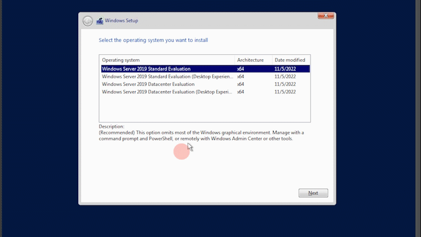
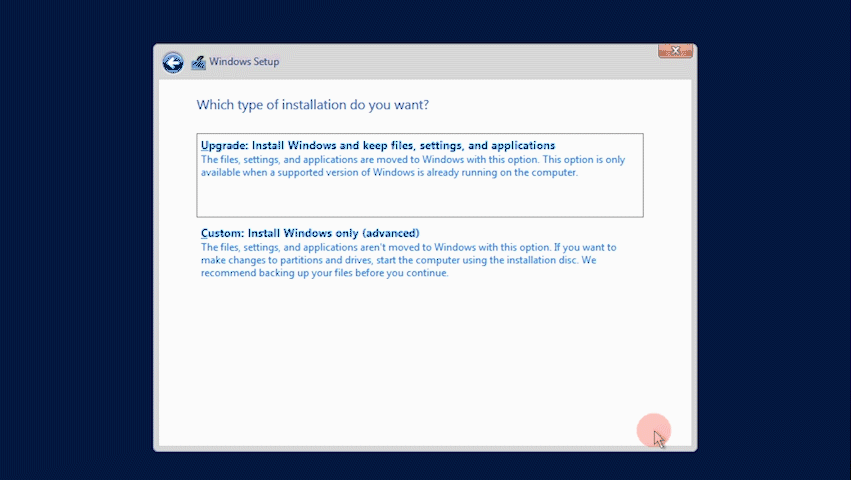

# Building a Virtual Mini Corporate Environment

This tutorial will guide you through the process of setting up a virtual corporate environment using Windows Server 2019. You'll learn how to install Windows Server 2019, configure Active Directory, DHCP, and DNS Server roles, create an administrative account, and add 50 users to Active Directory simultaneously. Let's get started!

## Prerequisites
Before we start, ensure you have the following:

1. **Hardware Requirements**:
   - A computer with at least 8 GB of RAM (16 GB recommended).
   - A multi-core processor (Quad-core or higher recommended).
   - Sufficient storage space (at least 50 GB free for the virtual machine).

2. **Software Requirements**:
   - **Virtualization Software**: Microsoft Hyper-V, VMware Workstation, or Oracle VirtualBox.
   - **Windows Server 2019 ISO**: Download from the Microsoft website.
   - **Windows 10 ISO**: Download from the Microsoft website.

3. **Network Requirements**:
   - A stable internet connection for downloading necessary software and updates.
   - Basic understanding of network concepts and IP addressing.

Next, we'll start with installing the virtualization software and setting up the virtual machine.

## Step 2: Installing Windows Server 2019

1. **Create a New Virtual Machine**:
   - Open your virtualization software (e.g., VMware Workstation or VirtualBox).
   - Click on "Create a New Virtual Machine" or a similar option.
   - Choose the option to install the operating system later if prompted.

2. **Configure the Virtual Machine**:
   - **Name**: Give your virtual machine a name (e.g., "Windows Server 2019").
   - **Location**: Choose a location to store the virtual machine files.
   - **Type**: Select "Microsoft Windows".
   - **Version**: Choose "Windows Server 2019".

3. **Allocate Resources**:
   - **Memory (RAM)**: Allocate at least 2 GB of RAM.
   - **Processor**: Assign at least 2 virtual processors.
   - **Hard Disk**: Create a new virtual hard disk with at least 32 GB of storage.

4. **Attach the Windows Server 2019 ISO**:
   - In the virtual machine settings, find the "CD/DVD" drive option.
   - Attach the Windows Server 2019 ISO file you downloaded earlier.

5. **Start the Virtual Machine**:
   - Power on the virtual machine.
   - The virtual machine will boot from the attached ISO file.

6. **Windows Server 2019 Installation**:
   - **Language, Time, and Keyboard**: Choose your preferences and click "Next".
   - Click **Install Now**.
  
    
   - Select **Windows Server 2019 Standard Datacenter**.
   - **License Agreement**: Accept the license terms and click "Next".
  
     
   - Choose **Custom: Install Windows only (advanced)**.
   - Select **Unallocated Space** and click **Next**. The installer will create the necessary partitions and start the installation.
   - The installation process will take several minutes. Once complete, the system will restart twice. Please do not press any buttons during this process.
     
     
             
   - After the restart, set a strong password for the Administrator account.
   - Login with the Administrator account using the password you set.
    
     
        
Once you're logged in, the basic installation of Windows Server 2019 is complete.

## Step 3: Configure NICs in Windows Server 2019

1. **Open Network Connections**:
   - Open the **Control Panel**.
   - Navigate to **Network and Sharing Center**.
   - Click on **Change adapter settings** on the left side.

2. **Rename NICs for easier identification**:
   - Right-click **Ethernet** and select **Rename**. Change the name to "INTERNET"
   - Right-click **Ethernet 2** and select **Rename**. Change the name to "INTERNAL"
     
    
3. **Configure Internal Network NIC**:
   - Right-click on "INTERNAL" and select **Properties**.
   - Select **Internet Protocol Version 4 (TCP/IPv4)** and click **Properties**.
   - Assign a static IP address:
     - IP address: 192.168.0.1
     - Subnet mask: 255.255.255.0
     - DNS server: 127.0.0.1
     - Leave the default gateway field empty.
    
       

4. **Verify Connectivity**:
   - Ensure that the "INTERNET" NIC has internet access.
   - The "INTERNAL" NIC should be isolated from the internet but able to communicate with internal clients.

Now that the NICs are configured, the server is set up to connect to the internet and to serve client machines on a private network.

## Step 3: Rename the Windows Server Machine
Renaming your server will help in identifying it easily on the network.

3. **Change Computer Name**:
   - Right-click the Start button. Select System. In the **System Properties** window, click the **Change** button.
   - In the **Computer Name/Domain Changes** window, enter a new name for your server in the **Computer name** field (e.g. "DC").
   - Click **OK**.

4. **Restart the Server**:
   - You will be prompted to restart your server to apply the changes.
   - Click **OK** on the prompt and then click **Close** on the System Properties window.
   - Click **Restart Now** to reboot the server.

After the server restarts, it will have the new name you assigned. This will make it easier to manage and identify on your network.

## Step 4: Installing Active Directory and Creating a Domain

1. **Open Server Manager**:
   - Click on the **Start** menu.
   - Select **Server Manager**.

2. **Add Roles and Features**:
   - In Server Manager, click on **Manage** in the upper-right corner.
   - Select **Add Roles and Features**.

3. **Before You Begin**:
   - Click **Next** on the "Before You Begin" page.

4. **Select Installation Type**:
   - Choose **Role-based or feature-based installation** and click **Next**.

5. **Select Destination Server**:
   - Ensure your server is selected in the server pool and click **Next**.

6. **Select Server Roles**:
   - Scroll down and select **Active Directory Domain Services**.
   - A dialog box will pop up to add the required features. Click **Add Features**.
   - Click **Next**.
   
     
     

7. Click **Next** on the "Select Features" page.
8. Click **Next** on the AD DS page.

9. Click **Install**.
10. Once complete, click **Close**.

    

#### Step 2: Promote the Server to a Domain Controller

1. **Post-Deployment Configuration**:
   - In Server Manager, you will see a yellow notification flag indicating that there is a post-deployment configuration pending.
   - Click on the **notification flag** and then click on **Promote this server to a domain controller**.
   
     
     

2. **Deployment Configuration**:
   - Select **Add a new forest**.
   - In the **Root domain name** field, enter the name for your new domain (e.g., "mydomain.com").
   - Click **Next**.
   
     
     

3. **Domain Controller Options**:
   - Choose a **forest functional level** and **domain functional level** (Windows Server 2016 is recommended).
   - Ensure **Domain Name System (DNS) server** and **Global Catalog (GC)** are selected.
   - Enter a **DSRM password** (Directory Services Restore Mode password) and click **Next**.

4. **DNS Options**:
   - Click **Next** on the DNS options page. You may see a warning about a delegation for this DNS server; you can safely ignore this for now.

5. **Additional Options**:
   - The NetBIOS domain name will be automatically filled based on your domain name. Verify it and click **Next**.

6. **Paths**:
   - Accept the default paths for the database, log files, and SYSVOL, and click **Next**.

7. **Review Options**:
   - Review your selections and click **Next**.

8. **Prerequisites Check**:
   - The wizard will run a prerequisites check. If everything passes, click **Install** to begin the promotion.

9. **Complete Installation and Restart**:
   - The server will install the necessary components and then automatically restart.

Once the server restarts, it will be a domain controller for your new domain.

## Step 5: Installing and Configuring Remote Access Service (RAS)

Remote Access Service (RAS) will allow clients on the internal network to access the internet through the domain controller.

#### Step 1: Install Remote Access Role

1. **Open Server Manager**:
   - Click on the **Start** menu.
   - Select **Server Manager**.

2. **Add Roles and Features**:
   - In Server Manager, click on **Manage** in the upper-right corner.
   - Select **Add Roles and Features**.

3. **Before You Begin**:
   - Click **Next** on the "Before You Begin" page.

4. **Select Installation Type**:
   - Choose **Role-based or feature-based installation** and click **Next**.

5. **Select Destination Server**:
   - Ensure your server is selected in the server pool and click **Next**.

6. **Select Server Roles**:
   - Scroll down and select **Remote Access**.
   - A dialog box will pop up to add the required features. Click **Add Features**.
   - Click **Next**.

7. **Select Features**:
   - Click **Next** on the "Select Features" page.

8. **Remote Access**:
   - Click **Next** on the Remote Access page.

9. **Role Services**:
   - Select **DirectAccess and VPN (RAS)**.
   - Click **Next**.

10. **Web Server (IIS)**:
    - Click **Next** on the Web Server (IIS) page.

11. **Role Services**:
    - Accept the default selections and click **Next**.

12. **Confirm Installation Selections**:
    - Click **Install**.
    - The installation will begin. Once complete, click **Close**.

#### Step 2: Configure Remote Access with NAT

1. **Open Remote Access Management**:
   - In Server Manager, click **Tools**.
   - Select **Routing and Remote Access**.

2. **Run the Getting Started Wizard**:
   - In the Routing and Remote Access console, right-click on your server name and select **Configure and Enable Routing and Remote Access**.

3. **Routing and Remote Access Setup Wizard**:
   - Click **Next** to begin the wizard.

4. **Configuration**:
   - Select **Network Address Translation (NAT)** and click **Next**.

5. **Public Interface**:
   - Select the network interface that connects to the internet (INTERNET). This interface will be used for public (internet) access.
   - Click **Next**.
   - Click **Finish**.

### Setting Up DHCP

Setting up DHCP on your Windows Server 2019 will allow computers on the network to automatically obtain IP addresses.

#### Step 1: Install the DHCP Server Role

1. **Open Server Manager**:
   - Click on the **Start** menu.
   - Select **Server Manager**.

2. **Add Roles and Features**:
   - In Server Manager, click on **Manage** in the upper-right corner.
   - Select **Add Roles and Features**.

3. **Before You Begin**:
   - Click **Next** on the "Before You Begin" page.

4. **Select Installation Type**:
   - Choose **Role-based or feature-based installation** and click **Next**.

5. **Select Destination Server**:
   - Ensure your server is selected in the server pool and click **Next**.

6. **Select Server Roles**:
   - Scroll down and select **DHCP Server**.
   - A dialog box will pop up to add the required features. Click **Add Features**.
   - Click **Next**.

7. **Select Features**:
   - Click **Next** on the "Select Features" page.

8. **DHCP Server**:
   - Click **Next** on the DHCP Server page.

9. **Confirm Installation Selections**:
   - Click **Install**.
   - The installation will begin. Once complete, click **Complete DHCP configuration**.

#### Step 2: Complete DHCP Configuration
Click on the **notification flag** and then click on **Promote this server to a domain controller**.

1. **Post-Install Configuration**:
   - In the **DHCP Post-Install Configuration Wizard**, click **Next**.

2. **Authorize DHCP Server**:
   - Ensure your administrator credentials are correct and click **Commit**.
   - Click **Close**

#### Step 3: Configure DHCP Scope

1. **Open DHCP Management**:
   - In Server Manager, click **Tools**.
   - Select **DHCP**.

2. **Create a New Scope**:
   - In the DHCP console, expand your server name.
   - Right-click on **IPv4** and select **New Scope**.

3. **New Scope Wizard**:
   - Click **Next** to start the wizard.

4. **Scope Name**:
   - Enter a name and description for the scope (e.g., "Internal Network Scope") and click **Next**.

5. **IP Address Range**:
   - Enter the IP address range that clients will use. For example:
     - Start IP address: 192.168.0.10
     - End IP address: 192.168.0.100
   - Enter the **Subnet mask** (e.g., 255.255.255.0) and click **Next**.

6. **Add Exclusions and Delay**:
   - If you have any IP addresses within the range that you want to exclude (e.g., static IPs for servers), add them here. Otherwise, click **Next**.

7. **Lease Duration**:
   - Specify the lease duration for IP addresses (default is 8 days) and click **Next**.

8. **Configure DHCP Options**:
   - Select **Yes, I want to configure these options now** and click **Next**.

9. **Router (Default Gateway)**:
   - Enter the IP address of the router or gateway for your network (e.g., 192.168.0.1) and click **Add**, then **Next**.

10. **Domain Name and DNS Servers**:
    - Enter your domain name (e.g., example.com).
    - Enter the IP address of your DNS server (usually the same as your domain controller) and click **Add**, then **Next**.

11. **WINS Servers**:
    - If you use WINS, enter the IP address of your WINS server. Otherwise, click **Next**.

12. **Activate Scope**:
    - Select **Yes, I want to activate this scope now** and click **Next**.

13. **Finish**:
    - Click **Finish** to complete the wizard.

Your DHCP server is now configured and active. Clients on your network should automatically receive IP addresses within the specified range.

### Creating an Administrative Account and Making it a Member of Domain Admins

To manage your network effectively, you'll need a dedicated administrative account that has elevated permissions. Here’s how to create this account and make it a member of the Domain Admins group:

#### Step 1: Create a New User Account

1. **Open Active Directory Users and Computers**:
   - Click on the **Start** menu.
   - Select **Administrative Tools** (or **Windows Administrative Tools**), then click **Active Directory Users and Computers**.

2. **Navigate to the Users Container**:
   - In the Active Directory Users and Computers console, expand your domain (e.g., example.com).
   - Click on the **Users** container.

3. **Create a New User**:
   - Right-click on the **Users** container.
   - Select **New**, then click **User**.

4. **New Object - User Wizard**:
   - **First Name**: Enter the user's first name (e.g., Admin).
   - **Last Name**: Enter the user's last name (e.g., Account).
   - **Full Name**: This field will be automatically populated based on the first and last name.
   - **User Logon Name**: Enter the logon name (e.g., admin).
   - Click **Next**.

5. **Password Setup**:
   - Enter a password for the new account.
   - Confirm the password.
   - Select the appropriate password options (e.g., **User must change password at next logon**, **User cannot change password**, **Password never expires**).
   - Click **Next**.

6. Review the information and click **Finish** to create the new user account.

#### Step 2: Add the New User to the Domain Admins Group

1. **Open the Properties of the New User**:
   - In the Active Directory Users and Computers console, locate the new user account you created (e.g., Admin Account).
   - Right-click on the user account and select **Properties**.

2. **Navigate to the Member Of Tab**:
   - In the user properties window, click on the **Member Of** tab.

3. **Add to Domain Admins Group**:
   - Click the **Add** button.
   - In the **Select Groups** dialog box, type **Domain Admins** and click **Check Names**.
   - If the group name resolves correctly, click **OK**.

4. **Confirm Membership**:
   - The Domain Admins group should now be listed in the **Member Of** tab.
   - Click **OK** to close the properties window.

#### Step 3: Verify the Administrative Privileges

1. **Log Off and Log On**:
   - Log off from the current session.
   - Log on with the new administrative account (e.g., admin@example.com).

2. **Verify Administrative Access**:
   - Ensure the new account has the appropriate administrative rights by performing tasks that require elevated privileges (e.g., opening Server Manager, accessing Active Directory Users and Computers).

By following these steps, you will have created a new administrative account and granted it Domain Admins privileges, allowing it to manage the domain effectively.

### Creating User Accounts

Let's create four user accounts in Active Directory.

#### Step 1: Open Active Directory Users and Computers

1. **Open Active Directory Users and Computers**:
   - Click on the **Start** menu.
   - Select **Administrative Tools** (or **Windows Administrative Tools**), then click **Active Directory Users and Computers**.

2. **Navigate to the Users Container**:
   - In the Active Directory Users and Computers console, expand your domain (e.g., example.com).
   - Click on the **Users** container.

#### Step 2: Create a New User Account

For each user, repeat the following steps:

1. **Create a New User**:
   - Right-click on the **Users** container.
   - Select **New**, then click **User**.

2. **New Object - User Wizard**:
   - **First Name**: Enter the user's first name (e.g., John).
   - **Last Name**: Enter the user's last name (e.g., Doe).
   - **Full Name**: This field will be automatically populated based on the first and last name.
   - **User Logon Name**: Enter the logon name (e.g., johndoe).
   - Click **Next**.

3. **Password Setup**:
   - Enter a password for the new account.
   - Confirm the password.
   - Select **User must change password at next logon**.
   - Click **Next**.

4. **Finish**:
   - Review the information and click **Finish** to create the new user account.

Continue the process until all four users have been created.

By following these steps, you will have created four normal user accounts in Active Directory. These users can now log in to the domain with their respective credentials.

