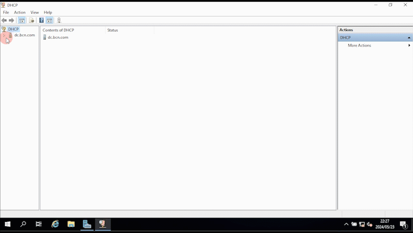

# Building a Virtual Mini Corporate Environment

This tutorial will guide you through the process of setting up a virtual corporate environment using Windows Server 2019. You'll learn how to install Windows Server 2019, configure Active Directory, DHCP, and DNS Server roles, create an administrative account, and add 3 users to Active Directory. Let's get started!

## Prerequisites
Before we start, ensure you have the following:

1. **Hardware Requirements**:
   - A computer with at least 8 GB of RAM (16 GB recommended).
   - A multi-core processor (Quad-core or higher recommended).
   - Sufficient storage space (at least 50 GB free for the virtual machine).

2. **Software Requirements**:
   - **Virtualization Software**: Microsoft Hyper-V, VMware Workstation, or Oracle VirtualBox.
   - **Windows Server 2019 ISO**: Download from the Microsoft website.
   - **Windows 10 ISO**: Download from the Microsoft website.

3. **Network Requirements**:
   - A stable internet connection for downloading necessary software and updates.
   - Basic understanding of network concepts and IP addressing.

Next, we'll start with installing the virtualization software and setting up the virtual machine.

## Step 1: Setting Up a Hyper-V Virtual Machine with Two NICs

To set up a Hyper-V virtual machine with two network interface cards (NICs), follow these steps:

## Step 1.1: Create Virtual Switches

1. **Create a Virtual Switch for External Network**:
   - Click on the **Start** menu.
   - Search for **Hyper-V Manager** and open it.
   - In Hyper-V Manager, click on **Virtual Switch Manager** in the right-hand Actions pane.
   - Select **New virtual network switch** and choose **External**.
   - Click **Create Virtual Switch**.

     

   - Name the switch "INTERNET".
   - Select the physical network adapter connected to the internet.
   - Click **Apply**, then click **OK**.

     

2. **Create a Virtual Switch for Internal Network**:
   - In Hyper-V Manager, click on **Virtual Switch Manager** again.
   - Choose **Internal**.
   - Click **Create Virtual Switch**.

     

   - Name the switch "INTERNAL".
   - Click **Apply**, then **OK**.

## Step 2: Create the Virtual Machine

1. **Create a New Virtual Machine**:
   - In Hyper-V Manager, click on **New** in the right-hand Actions pane.
   - Select **Virtual Machine**.

2. **New Virtual Machine Wizard**:
   - **Specify Name and Location**:
     - Name the VM "DC".
     - Click **Next**.
      
   - **Specify Generation**:
     - Choose **Generation 1**.
     - Click **Next**.
      
   - **Assign Memory**:
     - Assign at least 2 GB of memory (2048 MB) or more, depending on your system resources.
     - Click **Next**.
       
   - **Configure Networking**:
     - Select the newly created external switch(**INTERNET**).
     - Click **Next**.

       

   - **Connect Virtual Hard Disk**:
     - Create a new virtual hard disk with at least 20 GB of space.
     - Click **Next**.
      
   - **Installation Options**:
     - Select **Install an operating system from a bootable image file**.
     - Browse and select the Windows Server ISO file.
     - Click **Next**.

       

4. Click **Finish**.

## Step 3: Add the Internal Network Adapter to the Virtual Machine

1. **Add Network Adapter**:
   - In Hyper-V Manager, select the newly created virtual machine.
   - Right-click on the VM and select **Settings**.
   - In the **Settings** window, select **Add Hardware**.
   - Select **Network Adapter**, then click **Add**.

     

   - Connect it to the **INTERNAL**.
   - Click **Apply**, then click  **OK**.

     

## Step 4: Installing Windows Server 2019

1. **Start the Virtual Machine**:
   - In Hyper-V Manager, select the VM.
   - Right-click on the VM and select **Connect**.
   - Select **Start**.
   - The virtual machine will boot from the attached ISO file.

2. **Windows Server 2019 Installation**:
   - **Language, Time, and Keyboard**: Choose your preferences and click "Next".
   - Click **Install Now**
    
     
    
   - Select **Windows Server 2019 Standard Datacenter**.
   - **License Agreement**: Accept the license terms and click "Next".
    
     
     
   - Choose **Custom: Install Windows only (advanced)**.
   - Select **Unallocated Space** and click **Next**.
   - The installation process will take several minutes. Once complete, the system will restart twice. Please do not press any buttons during this process.
     
     
             
   - After the restart, set a strong password for the Administrator account.
   - Login with the Administrator account using the password you set.
    
     
        
Once you're logged in, the basic installation of Windows Server 2019 is complete.

## Step 5: Configure NICs in Windows Server

1. **Rename NICs for easier identification**:
   - Right-click the network icon. Click **Open Network and Settings**.
   - Click on **Change adapter settings**.

     

   - Right-click **Ethernet** and select **Rename**.
   - Change the name to "INTERNET".
   - Right-click **Ethernet 2** and select **Rename**.
   - Change the name to "INTERNAL"
    
     
    
2. **Configure Internal Network NIC**:
   - Right-click on "INTERNAL" and select **Properties**.
   - Select **Internet Protocol Version 4 (TCP/IPv4)** and click **Properties**.
   - Assign a static IP address:
     - IP address: 192.168.0.1
     - Subnet mask: 255.255.255.0
     - DNS server: 127.0.0.1
     - Leave the default gateway field empty.
      
     
       
3. Click **OK**.

Now that the NICs are configured, the server is set up to connect to the internet and to serve client machines on a private network.

### Rename the Windows Server Machine
Renaming your server will help in identifying it easily on the network.

1. **Change Computer Name**:
   - Right-click the Start button. Select **System**.
   - Click the **Rename this PC** button. Name the server "DC"
   - Click **Next**, then click **Restart now**.

After the server restarts, it will have the new name you assigned. This will make it easier to manage and identify on your network.

## Step 6: Installing Active Directory and Creating a Domain

1. **Open Server Manager**:
   - Click on the **Start** menu.
   - Select **Server Manager**.

2. Select **Add Roles and Features**.

3. Click **Next** on the "Before You Begin" page.

4. **Select Installation Type**:
   - Choose **Role-based or feature-based installation** and click **Next**.

5. **Select Destination Server**:
   - Ensure your server is selected in the server pool and click **Next**.

6. **Select Server Roles**:
   - Scroll down and select **Active Directory Domain Services**.
   - A dialog box will pop up to add the required features. Click **Add Features**.
   - Click **Next**.
   
     
     
7. Click **Next** on the "Select Features" page.

8. Click **Next** on the AD DS page.

9. Click **Install**.
    
10. Once complete, click **Close**.

    

### Step 6.2: Promote the Server to a Domain Controller

1. **Post-Deployment Configuration**:
   - In Server Manager, you will see a yellow notification flag indicating a post-deployment configuration pending.
   - Click on the **notification flag** and then click on **Promote this server to a domain controller**.
   
     
     
2. **Deployment Configuration**:
   - Select **Add a new forest**.
   - In the **Root domain name** field, enter the name for your new domain (e.g. mydomain.com).
   - Click **Next**.
   
     
     
3. **Domain Controller Options**:
   - Accept the default selections and enter a **Directory Services Restore Mode(DSRM)** password.
   - Click **Next**.
    
     

4. Click **Next** on the DNS options page. You may see a warning about a delegation for this DNS server, you can ignore this for now.

5. The NetBIOS domain name will be automatically filled based on your domain name. Click **Next**.

6. Accept the default paths for the database, log files, and SYSVOL, and click **Next**.

7. Review your selections and click **Next**.

8. Click **Install** to begin the promotion.

9. The server will install the necessary components and then automatically restart.

Once the server restarts, it will be a domain controller for your new domain.

## Step 7: Installing and Configuring Remote Access Service (RAS)

Remote Access Service (RAS) will allow clients on the internal network to access the internet through the domain controller.

### Step 7.1: Install Remote Access Role

1. **Open Server Manager**:
   - Click on the **Start** menu.
   - Select **Server Manager**.

2. Select **Add Roles and Features**.

3. Click **Next** on the "Before You Begin" page.

4. **Select Installation Type**:
   - Choose **Role-based or feature-based installation** and click **Next**.

5. **Select Destination Server**:
   - Ensure your server is selected in the server pool and click **Next**.

6. **Select Server Roles**:
   - Scroll down and select **Remote Access**.
   - Click **Next**.
   
     
     
7. Click **Next** on the "Select Features" page.
   
9. Click **Next** on the Remote Access page.

10. **Role Services**:
    - Select **DirectAccess and VPN (RAS)**.
    - Click **Add Features**, then click **Next**.

      
     
11. Click **Next** on the Web Server (IIS) page.

12. Accept the default selections and click **Next**.

13. Click **Install**.

14. Once complete, click **Close**.

    

### Step 7.2: Configure Remote Access with NAT

1. **Open Remote Access Management**:
   - In Server Manager, click **Tools**.
   - Select **Routing and Remote Access**.

     
     
2. Right-click on your server name and select **Configure and Enable Routing and Remote Access**.
   
   

3. Click **Next** to begin the wizard.

4. Select **Network Address Translation (NAT)** and click **Next**.

5. **Public Interface**:
   - Select the network interface that connects to the internet (INTERNET). This interface will be used for public (internet) access.
   - Click **Next**, then click **Finish**.
  
     

## Step 8: Installing and Configuring DHCP

Setting up DHCP on your Windows Server 2019 will allow computers on the network to automatically obtain IP addresses.

### Step 8.1: Install the DHCP Server Role

1. **Open Server Manager**:
   - Click on the **Start** menu.
   - Select **Server Manager**.

2. Select **Add Roles and Features**.

3. Click **Next** on the "Before You Begin" page.

4. Choose **Role-based or feature-based installation** and click **Next**.

5. **Select Destination Server**:
   - Ensure your server is selected in the server pool and click **Next**.

6. **Select Server Roles**:
   - Scroll down and select **DHCP Server**.
   - A dialog box will pop up to add the required features. Click **Add Features**.
   - Click **Next**.
  
     
  
8. Click **Next** on the "Select Features" page.

9. Click **Next** on the DHCP Server page.

10. Click **Install**.

11. Once complete, click **Close**.

       

### Step 8.2: Complete DHCP Configuration

1. Click on the **yellow notification flag** and then click on **Complete DHCP configuration**.

   

2. Click **Next**.

3. Ensure your administrator credentials are correct and click **Commit**.

   

4. Click **Close**
   
### Step 8.3: Configure DHCP Scope

1. **Open DHCP Management**:
   - In Server Manager, click **Tools**.
   - Select **DHCP**.

2. **Create a New Scope**:
   - In the DHCP console, expand your server name.
   - Right-click on **IPv4** and select **New Scope**.
  
     

3. Click **Next** to start the wizard.

4. **Scope Name**:
   - Enter a name and description for the scope (e.g., "Internal Network Scope") and click **Next**.

5. **IP Address Range**:
   - Enter the IP address range that clients will use. For example:
     - Start IP address: 192.168.0.10
     - End IP address: 192.168.0.100
   - Length: 24 
   - Enter the **Subnet mask** (e.g., 255.255.255.0) and click **Next**.
  
     

6. Accept the default lease duration and click **Next**.

7. Select **Yes, I want to configure these options now** and click **Next**.

8. **Router (Default Gateway)**:
   - Enter the IP address of the router or gateway for your network (192.168.0.1) and click **Add**, then **Next**.
  
     

9. **Domain Name and DNS Server**:
   - Parent domain: This field will be automatically
   - Click **Next**

10. Click **Next**.

11. Select **Yes, I want to activate this scope now** and click **Next**.

12. Click **Finish** to complete the wizard.

Your DHCP server is now configured and active. Clients on your network should automatically receive IP addresses within the specified range.

## Step 9: Creating an Administrative Account and Making it a Member of Domain Admins

To manage your network effectively, you'll need a dedicated administrative account that has elevated permissions.

### Step 9.1: Create a New User Account

1. **Open Active Directory Users and Computers**:
   - Click on the **Start** menu.
   - Select **Windows Administrative Tools** and then click **Active Directory Users and Computers**.
      
     

2. **Create a New User**:
   - In the Active Directory Users and Computers console, expand your domain.
   - Click on the **Users** container.
   - Right-click on the **Users** container.
   - Select **New**, then click **User**.
  
     

3. **New Object - User Wizard**:
   - First Name: Enter the user's first name (e.g. Ondela).
   - Last Name: Enter the user's last name (e.g. Dlokovu).
   - Full Name: This field will be automatically populated based on the first and last name.
   - User Logon Name: Enter the logon name (e.g. ondelad).
   - Click **Next**.

4. **Password Setup**:
   - Enter a password for the new account.
   - Confirm the password.
   - Select **Password never expires** for the project sake
   - Click **Next**.

5. Click **Finish** to create the new user account.

### Step 9.2: Add the New User to the Domain Admins Group

1. **Open the Properties of the New User**:
   - In the Active Directory Users and Computers console, locate the new user account you created.
   - Right-click on the user account and select **Properties**.
  
     

2. **Add to Domain Admins Group**:
   - In the user properties window, click on the **Member Of** tab.
   - Click the **Add** button.
   - In the **Select Groups** dialog box, type **Domain Admins** and click **Check Names**.
   - If the group name resolves correctly, click **OK**.
  
     

4. Click **Apply**, then click **OK**.

5. Log off from the current session. Log on with the new administrative account. 

   

By following these steps, you will have created a new administrative account and granted it Domain Admins privileges, allowing it to manage the domain effectively.

### Creating User Accounts

Let's create four user accounts in Active Directory.

#### Step 1: Open Active Directory Users and Computers

1. **Open Active Directory Users and Computers**:
   - Click on the **Start** menu.
   - Select **Windows Administrative Tools** and then click **Active Directory Users and Computers**.

2. **Navigate to the Users Container**:
   - In the Active Directory Users and Computers console, expand your domain.
   - Click on the **Users** container.

#### Step 2: Create a New User Account

For each user, repeat the following steps:

1. **Create a New User**:
   - Right-click on the **Users** container.
   - Select **New**, then click **User**.

2. **New Object - User Wizard**:
   - **First Name**: Enter the user's first name (e.g. Peter).
   - **Last Name**: Enter the user's last name (e.g. Parker).
   - **Full Name**: This field will be automatically populated based on the first and last name.
   - **User Logon Name**: Enter the logon name (e.g. peterp).
   - Click **Next**.

3. **Password Setup**:
   - Enter a password for the new account.
   - Confirm the password.
   - Select **User must change password at next logon**.
   - Click **Next**.

4. Click **Finish** to create the new user account.

Continue the process until all three users have been created.

By following these steps, you will have created four normal user accounts in Active Directory. These users can now log in to the domain with their respective credentials.

## Step 10: Creating a Windows 10 Client Machine

To create a Windows 10 client machine and join it to the domain, follow these steps:

### Step 10.1: Create a New Virtual Machine for Windows 10

1. **Open Hyper-V Manager**:
   - Click on the **Start** menu.
   - Search for **Hyper-V Manager** and open it.

2. **Create a New Virtual Machine**:
   - In Hyper-V Manager, click **New** in the right-hand Actions pane.
   - Select **Virtual Machine**.

3. **New Virtual Machine Wizard**:
   - **Specify Name and Location**:
     - Name the VM (e.g., Windows10Client).
     - Click **Next**.
      
   - **Specify Generation**:
     - Choose **Generation 1**.
     - Click **Next**.
       
   - **Assign Memory**:
     - Assign at least 2 GB of memory (2048 MB) or more, depending on your system resources.
     - Click **Next**.
       
   - **Configure Networking**:
     - Select the internal network you created earlier for the internal network adapter.
     - Click **Next**.
       
   - **Connect Virtual Hard Disk**:
     - Create a new virtual hard disk with at least 60 GB of space.
     - Click **Next**.
       
   - **Installation Options**:
     - Select **Install an operating system from a bootable image file**.
     - Browse and select the Windows 10 ISO file.
     - Click **Next**.

4. Click **Finish** to create the virtual machine.

### Step 10.2: Install Windows 10 on the Virtual Machine

1. **Start the Virtual Machine**:
   - In Hyper-V Manager, select the VM.
   - Right-click on the VM and select **Connect**.
   - Select **Start**.
   - The virtual machine will boot from the attached ISO file.

2. **Windows 10 Pro Installation**:
   - Follow the on-screen prompts to install Windows 10.
   - Select the appropriate language, time, and keyboard settings.
   - Click **Next** and then **Install Now**.
   - Enter the Windows 10 product key if required.
   - Accept the license terms and click **Next**.
   - Choose **Custom: Install Windows only (advanced)**.
   - Select the virtual hard disk and click **Next**.
   - The installation process will begin and the VM will restart several times.

3. **Complete Setup**:
   - Follow the on-screen prompts to complete the Windows 10 setup.
   - Create a local user account temporarily.

## Step 11: Join the Windows 10 Client to the Domain

1. **Log in to the Windows 10 Client**:
   - Log in with the local user account you created during setup.

2. **Configure Network Settings**:
   - Ensure the client machine is connected to the internal network.
   - Open **Settings** > **Network & Internet** > **Status**.
   - Click on **Change adapter options**.
   - Right-click on the network adapter connected to the internal network and select **Properties**.
   - Ensure the network is set to **Private**.

3. **Join the Domain**:
   - Right-click **Start button**. Select **System**. Click **Rename (advance)**.

   - 

   - Click **Change**.
   - Rename **Computer name** (e.g. BCN01) 
   - Select **Domain**. Enter the domain name and click **OK**.
   - Enter the credentials of a domain user with permission to join computers to the domain (e.g. the admin account created earlier).
  
   - 

   - Follow the prompts to join the domain.

5. After successfully joining the domain, restart the computer.

6. **Log in with Domain Credentials**:
   - On the login screen, click **Other user**.
   - Enter the domain credentials (e.g., johndoe@example.com) for one of the users created earlier.

   - 

   - Log in to verify that the user can access the domain.

With these steps, you have created a Windows 10 client machine and joined it to the domain. The client machine can now be used by domain users.

Let me know when you're ready to proceed to the next step!

